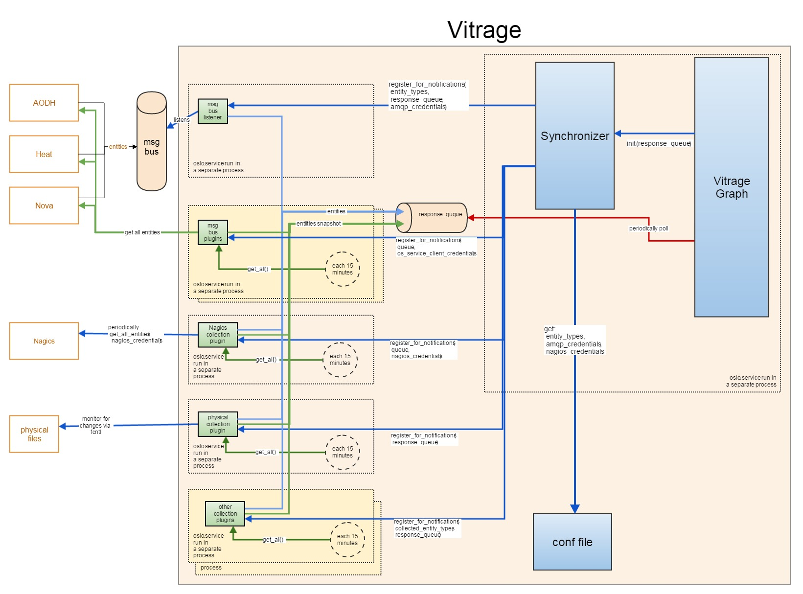

..
 This work is licensed under a Creative Commons Attribution 3.0 Unported
 License.

 http://creativecommons.org/licenses/by/3.0/legalcode

============
Synchronizer
============
The synchronizer is a vitrage inner module which supplies both a snapshot (all the entities)
of openstack services via poll requests, or, 
change notifications for entities which comprise the same OS services,
via push notifications.

Problem description
===================

Enable vitrage and to maintain the most up-to-date view of OS services, Nagios, etc., it samples.

Proposed change
===============
periodically samples OS services, Nagios, etc., and produces up to date entities once changed (in contrast to deltas)

design
------

interacting with the module
^^^^^^^^^^^^^^^^^^^^^^^^^^^

get all notifications
"""""""""""""""""""""
- list of entity types

change notifications
""""""""""""""""""""
- registration:
     supply a list of entity types and a callback function for the synchronizer to invoke for sending information back concurrent immediate    execution (a call for this function is would not block the caller)done by the vitrage graph manager
- push notifications

synchronizers response
""""""""""""""""""""""
- either list-all and notifications response contains entities
- each entity must contain:keyparent/child keytypetimestamp?CRUD action (new entity/updated/...)state (active/shutdown/…)project (role)

synchronizer plugins
^^^^^^^^^^^^^^^^^^^^
kinds of plugins:

Message bus plugin
""""""""""""""""""
- register for message bus notifications via the oslo-messaging library

Collector plugin
""""""""""""""""

::

 +-------------------------------------------------------------------------------------------------+
 |                                                                                                 |
 |       vitrage graph    ^                                                      ^                 |
 |                        |                                                      |                 |
 +-------------------------------------------------------------------------------------------------+
                          |                                                      |
 +------------------------------------------------------------------------------------------------+
 |                        |          synchronizer                                |                |
 |                        |                                                      |                |
 |                        |                                                      |                |
 |               +--------+-----------------------+     collect          +-------+------------+   |
 |               |                                |     notifications    |                    |   |
 |               |     worker                     +---+-------------+    |  worker            |   |
 |               |                                |   |             |    |                    |   |
 |               +--------------------------------+   |             |    +------------------+-+   |
 |                          notification              |             |          collect      |     |
 |                                                    |             |          notifications|     |
 |                                                    |             |                       |     |
 | +------------------------------------------------------------+  +v----------+  +------------+  |
 | |                         collector plugin         |         |  | msg bus   |  |  msg bus|  |  |
 | |                                                  |         |  | plugin    |  |  plugin v  |  |
 | |                                                  |         |  |           |  |            |  |
 | |                                                  |         |  |           |  |            |  |
 | |                                                  |         |  |           |  |            |  |
 | |                                                  |         |  |           |  |            |  |
 | |                                                  |         |  |           |  |            |  |
 | |                                                  |         |  |           |  |            |  |
 | |             +----------------------------+       |         |  |           |  |            |  |
 | |    baseline:|hash0|hash1|hash2|hash3|... | <-----+         |  |           |  |            |  |
 | |             +----------^-----------------+       |         |  |           |  |            |  |
 | |                        |if                       |         |  |           |  |            |  |
 | |                        |hash(item)!=hash1 ==>    |         |  |           |  |            |  |
 | |                        |propagate item as a      |         |  |           |  |            |  |
 | |                        |change notification      |         |  |           |  |            |  |
 | |                        |                         |         |  |           |  |            |  |
 | |            +-----------+---------------+         |         |  |           |  |            |  |
 | |            |sampling  ^             <------------+         |  |           |  |            |  |
 | |            +----------|----------------+                   |  |           |  |            |  |
 | |                       |                                    |  |           |  |            |  |
 | |                                                            |  |           |  |            |  |
 | |                       |                                    |  |           |  |            |  |
 | +------------------------------------------------------------+  +-----------+  +------------+  |
 |                         |                                                                      |
 +------------------------------------------------------------------------------------------------+
                           |
               +-----------+-------------------+
               |      OS service               |
               +-------------------------------+

- samples OS services, Nagios, etc.
- via each OS service REST API
- method of collection:
   retrieve OS service elements list. For the purposes of:change
   notifications - as part of the periodic collection of the latest snapshot
    we'd use this method of collection against OS services which doesn't
    propagates change notification.run on its own collection subprocesses
    how to discover a change once a snapshot is collected, we'd like to know
    which entity was changed from the latest time a snapshot was taken in order
  to enable this, we'd keep a baseline - a data structure which contains for each OS service entity (such as a vm instance), its ID + it latest collection timestamp or a hash which represents its latest state.by comparing the latest snapshot of elements against the baseline, we'd know for which entity we'd like to propagate a notification for.collect deltas for services which reveals this functionality for the purposes of change notifications this is the easy case, where change notifications are simply passed on to whoever registered for them
- deployment - as a library

consumer flow
^^^^^^^^^^^^^
- new plugin:
   write my_plugin.py:
    my_plugin(synchronizer.BasePlugin): ...
    register my_plugin class path in conf file
    install an egg which contains a my_plugin.py
    restart vitrage service
- initial configuration:
    - configure nova, heat, etc. to send message bus notifications for vitrage too (consumption of msg bus notification by the listener removes it from the queue)
    - configure active entity types
    - configure message bus credentials for the msg bus listener
    - configure nagios credentials

- register for 'change notification' - for a streaming change notifications, upon synchronizer initialization, the consumer would supply the queue on which the notifications would be returned to upon synchronizer initialization which would spawn subprocesses which would call the 'get all' periodically in order to supply the graph with the latest snapshot.

Alternatives
------------

None

Data model impact
-----------------

**TBD**

REST API impact
---------------

**TBD**

Versioning impact
-----------------

**TBD**

Other end user impact
---------------------

None

Deployer impact
---------------

**TBD**

Developer impact
----------------

**TBD**

Horizon impact
--------------

None

Implementation
==============

Assignee(s)
-----------

**TBD**

Work Items
----------

**TBD**

Dependencies
============

**TBD**

Testing
=======
Unit Tests - Tox
Integration Tests - Tempest

Documentation Impact
====================

**TBD**

References
==========

**TBD**
