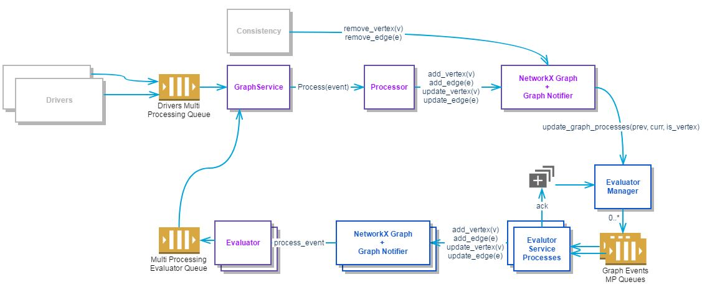

..
 This work is licensed under a Creative Commons Attribution 3.0 Unported
 License.

 http://creativecommons.org/licenses/by/3.0/legalcode

========================================
Parallel evaluation of Vitrage templates
========================================

https://blueprints.launchpad.net/vitrage/+spec/parallel-evaluation

Currently Vitrage sequentially processes and evaluates incoming events.
While it is a necessity to run sequential processing, template evaluation
for a single event is independent and can be paralleled.
The challenge is NetworkX in-memory graph held by a single process, thus
preventing parallelism, this can be addressed by creating evaluator worker
processes that maintain clones of the graph.

Problem description
===================

Each and every graph change triggers evaluation of all relevant template
conditions, thus run time of event processing is dependent upon the number
of loaded templates.

 - Processor receives an event, from either the datasource or evaluator queue
 - Processor updates the graph
 - Evaluator is triggered to run relevant templates
 - Evaluation may result in an event writen to the evaluator queue

The above flow runs on in memory NetworkX graph in a single thread

.. figure:: ./parallel_current.jpg
   :width: 100%
   :align: center
   :alt: Problem description

Proposed change
===============

One or more EvaluatorWorker processes will be added to vitrage-graph service.
These processes keep their own graph instance. A new component
EvaluatorManager manages the communication with the EvaluatorWorkers.
Per each graph change resulted in the processor, it will request the
EvaluatorManager to inform all the EvaluatorWorkers, so in effect these hold
an identical graph clone.
Each EvaluatorWorker runs a portion of the templates, writing its results to
evaluator queue.

The flow will be as follows:

 - Processor receives an event, from either the datasource or evaluator queue
 - Processor updates the graph
 - EvaluatorManager is triggered, sending the event to the N EvaluatorWorkers,
   via N multiprocessing queues, then waits for their ack signal
 - Each EvaluatorWorker updates it's own graph
 - In each EvaluatorWorker the evaluator is triggered to run a portion of the
   templates
 - Evaluation may result in an event writen to the evaluator queue

Alternatives
------------

None

Data model impact
-----------------

None

REST API impact
---------------

None

Versioning impact
-----------------

None

Other end user impact
---------------------

None

Deployer impact
---------------

Each EvaluatorWorker holds a clone of the in memory Entity Graph, hence memory
consumption will increase as the configured number of workers increases.

Developer impact
----------------

None

Horizon impact
--------------

None

Implementation
==============

Assignee(s)
-----------

Primary assignee:
  idan-hefetz

Other contributors:
  None

Work Items
----------

- processor should not hold a ScenarioEvaluator
- create EvaluatorManager
- create EvaluatorWorker
- change main in graph.py
- change GraphService to handle these changes
- Choose the best way to assign tasks to workers

Dependencies
============

None

Testing
=======

The implementation will be covered by additional unit test

Documentation Impact
====================

None

References
==========

None

